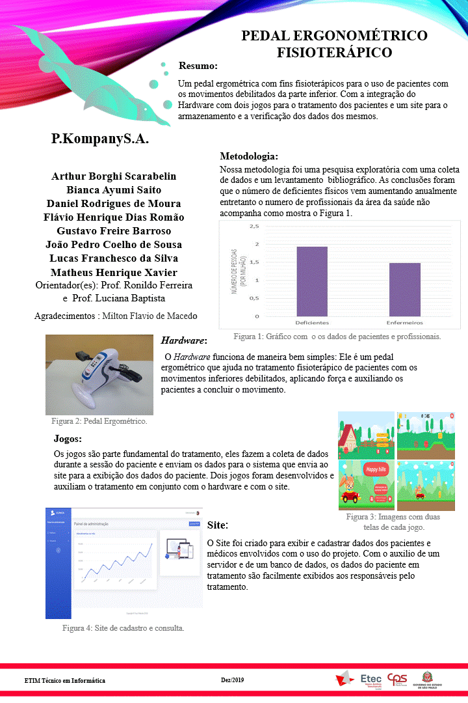
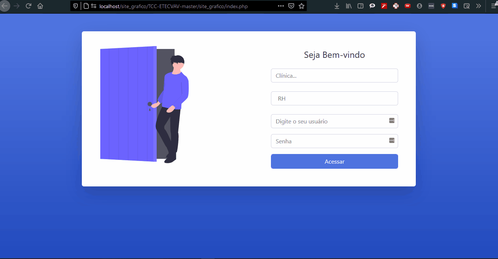

# Site para apresentação dos dados obtidos atraves dos jogos e para registro de paciente e mdicos 

## Resumo: 
Um pedal ergométrico com fins fisioterápicos para o uso de pacientes com os movimentos debilitados da parte inferior. 
Com a integração do Hardware com dois jogos para o tratamento dos pacientes e um site para o armazenamento e a verificação e Análise dos dados dos mesmos

## Hardware:
  O Hardware funciona de maneira bem simples: Ele é um pedal ergométrico que ajuda no tratamento fisioterápico de pacientes com os movimentos inferiores debilitados, aplicando força e auxiliando os pacientes a concluir o movimento.

  

# Ultilização

  * Criar bd localhost Chamado clinica
  
  * Execultar script BD dentro do banco de dados clinica 
  
  

  

